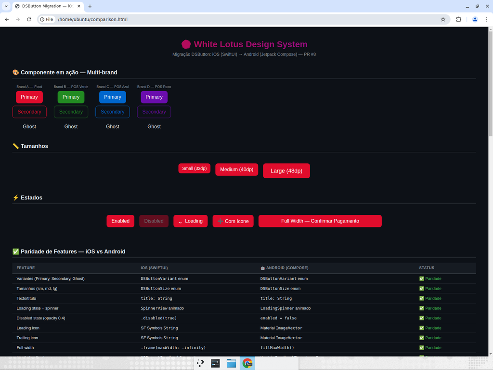
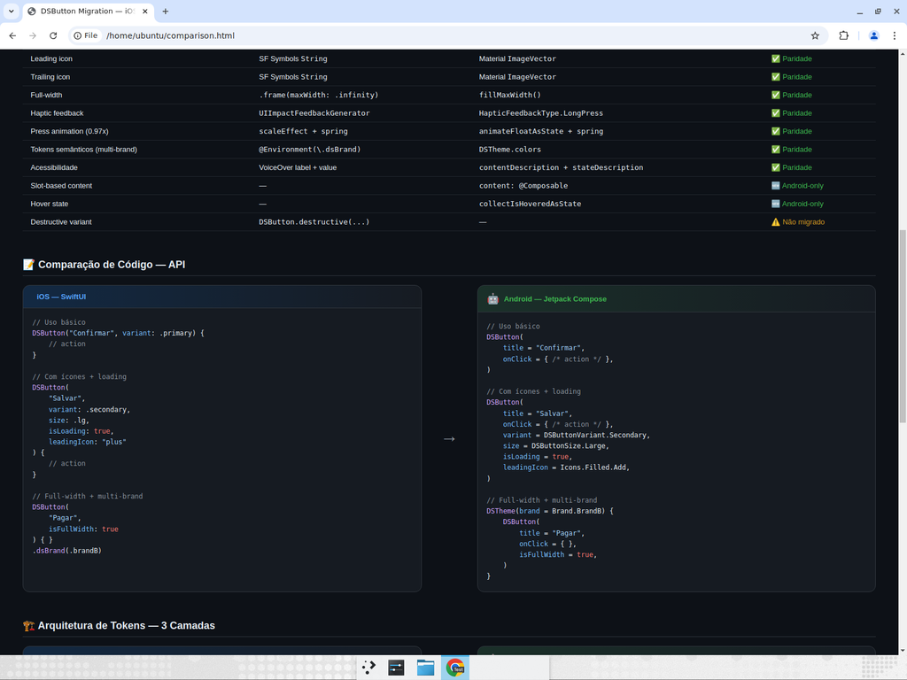
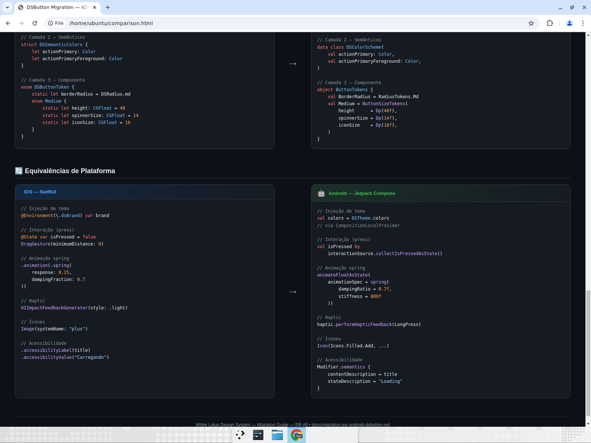

# Migration Guide: DSButton — iOS (SwiftUI) → Android (Jetpack Compose)

> Documento de referencia da migração do componente `DSButton` da plataforma iOS (SwiftUI) para Android (Jetpack Compose), realizada no PR [#8](https://github.com/LouizeB/White-Lotus-/pull/8).

---

## Visao geral visual

### Multi-brand, tamanhos, estados e tabela de paridade



### Tabela de paridade completa e comparacao de codigo (API)



### Arquitetura de tokens (3 camadas) e equivalencias de plataforma



---

## Sumario

1. [Visao geral visual](#visao-geral-visual)
2. [Contexto](#contexto)
3. [Arquitetura de tokens (3 camadas)](#arquitetura-de-tokens-3-camadas)
4. [Mapeamento de APIs](#mapeamento-de-apis)
5. [Decisoes de migracao](#decisoes-de-migracao)
6. [Comparacao feature-by-feature](#comparacao-feature-by-feature)
7. [Equivalencias de plataforma](#equivalencias-de-plataforma)
8. [Exemplos de uso](#exemplos-de-uso)
9. [Arquivos impactados](#arquivos-impactados)
10. [Limitacoes e trade-offs](#limitacoes-e-trade-offs)
11. [Recomendacoes para futuras migracoes](#recomendacoes-para-futuras-migracoes)

---

## Contexto

O Design System White Lotus utiliza uma arquitetura **multi-brand** onde o mesmo componente funcional adapta sua identidade visual (cores, tipografia, espacamento) com base na marca ativa. A implementacao iOS do `DSButton` em SwiftUI serviu como referencia madura para criar a versao Android equivalente em Jetpack Compose.

**Premissa principal:** manter paridade conceitual entre plataformas — mesma filosofia de design tokens, mesmo modelo de interacao, mesmas variantes — sem criar um botao Material generico.

---

## Arquitetura de tokens (3 camadas)

Ambas as plataformas seguem a mesma hierarquia de tokens:

```
Camada 1 — Primitivos (valores brutos)
  iOS:     DSColorPrimitive, DSSpacing, DSFontSize
  Android: ColorPrimitives, SpacingTokens, TypographyTokens

Camada 2 — Semanticos (significado por marca)
  iOS:     DSSemanticColors (via DSBrand)
  Android: DSColorScheme (via DSTheme/LocalDSColorScheme)

Camada 3 — Componente (decisoes especificas do botao)
  iOS:     DSButtonToken (Small/Medium/Large)
  Android: ButtonTokens (Small/Medium/Large)
```

Componentes **nunca** referenciam primitivos diretamente — somente tokens semanticos e de componente. Isso e o que permite a troca de marca sem alterar codigo de componente.

---

## Mapeamento de APIs

### iOS (SwiftUI)

```swift
DSButton(
    "Confirmar",              // title
    variant: .primary,        // .primary | .secondary | .ghost
    size: .md,                // .sm | .md | .lg
    isLoading: false,
    isFullWidth: false,
    leadingIcon: "plus",      // SF Symbols string
    trailingIcon: nil,
    action: { /* ... */ }
)
```

### Android (Jetpack Compose) — API de conveniencia

```kotlin
DSButton(
    title = "Confirmar",
    onClick = { /* ... */ },
    variant = DSButtonVariant.Primary,   // Primary | Secondary | Ghost
    size = DSButtonSize.Medium,          // Small | Medium | Large
    isLoading = false,
    isFullWidth = false,
    leadingIcon = Icons.Filled.Add,      // ImageVector (Material Icons)
    trailingIcon = null,
)
```

### Android (Jetpack Compose) — API slot-based (avancada)

```kotlin
DSButton(
    onClick = { /* ... */ },
    variant = DSButtonVariant.Primary,
    size = DSButtonSize.Medium,
    isLoading = false,
    isFullWidth = true,
) {
    Icon(Icons.Filled.Add, contentDescription = null)
    Text("Adicionar item")
}
```

> A API slot-based permite composicoes customizadas (multiplos icones, badges, etc.) enquanto a API de conveniencia cobre o caso de uso mais comum com menos boilerplate.

---

## Decisoes de migracao

| Decisao | Justificativa |
|---------|---------------|
| **Manter `packages/kotlin-ui`** em vez de criar `packages/android` | Ja existia infraestrutura completa de tokens e tema; criar diretorio paralelo duplicaria codigo |
| **Duas APIs (slot + conveniencia)** | A slot-based ja existia; a de conveniencia espelha a API iOS para facilitar paridade |
| **`ImageVector` ao inves de `String`** (SF Symbols) | Mais seguro em tempo de compilacao; idiomatico no Compose |
| **`HapticFeedbackType.LongPress`** | Equivalente mais proximo do `UIImpactFeedbackGenerator(.light)` no Android |
| **Spring animation com `dampingRatio=0.7`** | Replica a sensacao do `spring(response: 0.15, dampingFraction: 0.7)` do iOS |
| **`spinnerSize` e `iconSize` no `ButtonSizeTokens`** | Tokens de componente ja existiam; adicionar campos mantem a arquitetura coesa |
| **Loading tem prioridade sobre Disabled na acessibilidade** | Quando o spinner esta visivel, a informacao "Loading" e mais relevante para screen readers |

---

## Comparacao feature-by-feature

| Feature | iOS (SwiftUI) | Android (Compose) | Status |
|---------|---------------|-------------------|--------|
| Variantes (Primary, Secondary, Ghost) | `DSButtonVariant` enum | `DSButtonVariant` enum | Paridade |
| Tamanhos (sm, md, lg) | `DSButtonSize` enum | `DSButtonSize` enum | Paridade |
| Texto/titulo | `title: String` | `title: String` | Paridade |
| Loading state + spinner | `isLoading: Bool` + `SpinnerView` | `isLoading: Boolean` + `LoadingSpinner` | Paridade |
| Disabled state | `.disabled(true)` + opacity 0.4 | `enabled = false` + alpha 0.4f | Paridade |
| Leading icon | `leadingIcon: String?` (SF Symbols) | `leadingIcon: ImageVector?` (Material) | Paridade (tipo diferente) |
| Trailing icon | `trailingIcon: String?` | `trailingIcon: ImageVector?` | Paridade (tipo diferente) |
| Full-width | `isFullWidth: Bool` → `.infinity` | `isFullWidth: Boolean` → `fillMaxWidth()` | Paridade |
| Haptic feedback | `UIImpactFeedbackGenerator(.light)` | `HapticFeedbackType.LongPress` | Paridade (intensidade varia por OEM) |
| Press animation | `scaleEffect(0.97)` + spring | `animateFloatAsState(0.97f)` + spring | Paridade |
| Spinner tamanho por size | 12/14/16 pt | 12/14/16 dp | Paridade |
| Icon tamanho por size | 14/16/18 pt | 14/16/18 dp | Paridade |
| Tokens semanticos (multi-brand) | `@Environment(\.dsBrand)` | `DSTheme.colors` (CompositionLocal) | Paridade |
| Acessibilidade label | `accessibilityLabel(title)` | `contentDescription = title` | Paridade |
| Acessibilidade state | `accessibilityValue` | `stateDescription` | Paridade |
| Acessibilidade hint | `accessibilityHint("Aguarde...")` | — | Nao migrado (hint) |
| Hover state | — (iOS nao tem hover) | `collectIsHoveredAsState()` | Android-only (desktop/ChromeOS) |
| Slot-based content | — | `content: @Composable () -> Unit` | Android-only (flexibilidade extra) |
| Destructive variant | `DSButton.destructive(...)` | — | Nao migrado |

---

## Equivalencias de plataforma

| Conceito | iOS / SwiftUI | Android / Compose |
|----------|---------------|-------------------|
| Injecao de tema | `@Environment(\.dsBrand)` | `CompositionLocalProvider` + `LocalDSColorScheme` |
| Enabled state | `@Environment(\.isEnabled)` | Parametro `enabled: Boolean` |
| Interacao (press) | `DragGesture` + `@State isPressed` | `MutableInteractionSource` + `collectIsPressedAsState()` |
| Animacao spring | `.animation(.spring(...))` | `animateFloatAsState(spring(...))` |
| Icones | SF Symbols (`Image(systemName:)`) | Material Icons (`Icon(imageVector:)`) |
| Feedback haptico | `UIImpactFeedbackGenerator` | `LocalHapticFeedback.current` |
| Full-width | `.frame(maxWidth: .infinity)` | `Modifier.fillMaxWidth()` |
| Border | `.strokeBorder(...)` | `BorderStroke(...)` |
| Accessibility | `.accessibilityLabel/Value/Hint` | `Modifier.semantics { contentDescription, stateDescription }` |
| Preview | `PreviewProvider` / `#Preview` | `@Preview` + `@Composable` |

---

## Exemplos de uso

### Variantes

```kotlin
// Primary (padrao)
DSButton(title = "Confirmar", onClick = { })

// Secondary (outlined)
DSButton(title = "Cancelar", onClick = { }, variant = DSButtonVariant.Secondary)

// Ghost (text-only)
DSButton(title = "Saiba mais", onClick = { }, variant = DSButtonVariant.Ghost)
```

### Tamanhos

```kotlin
DSButton(title = "Pequeno", onClick = { }, size = DSButtonSize.Small)
DSButton(title = "Medio",   onClick = { }, size = DSButtonSize.Medium)
DSButton(title = "Grande",  onClick = { }, size = DSButtonSize.Large)
```

### Com icones

```kotlin
DSButton(
    title = "Adicionar",
    onClick = { },
    leadingIcon = Icons.Filled.Add,
)

DSButton(
    title = "Proximo",
    onClick = { },
    trailingIcon = Icons.Filled.ArrowForward,
)
```

### Loading state

```kotlin
DSButton(
    title = "Processando",
    onClick = { },
    isLoading = true,  // bloqueia interacao + mostra spinner
)
```

### Full-width

```kotlin
DSButton(
    title = "Confirmar Pagamento",
    onClick = { },
    variant = DSButtonVariant.Primary,
    size = DSButtonSize.Large,
    isFullWidth = true,
)
```

### Multi-brand

```kotlin
// A troca de marca acontece no nivel do tema — o componente nao muda
DSTheme(brand = Brand.BrandA) {
    DSButton(title = "iFood", onClick = { })  // vermelho
}

DSTheme(brand = Brand.BrandB) {
    DSButton(title = "POS Verde", onClick = { })  // verde
}
```

---

## Arquivos impactados

| Arquivo | Tipo | Descricao |
|---------|------|-----------|
| `packages/kotlin-ui/src/main/kotlin/com/ds/components/button/DSButton.kt` | Modificado | API de conveniencia, isFullWidth, haptic, press animation, accessibility |
| `packages/kotlin-ui/src/main/kotlin/com/ds/components/button/DSButtonPreview.kt` | Modificado | Previews para icones, full-width, tamanhos |
| `packages/kotlin-ui/src/main/kotlin/com/ds/tokens/component/ButtonTokens.kt` | Modificado | `spinnerSize` e `iconSize` em `ButtonSizeTokens` |
| `packages/kotlin-ui/build.gradle.kts` | Modificado | Dependencias `material-icons-core` e `material-icons-extended` |

**Zero arquivos iOS modificados.**

---

## Limitacoes e trade-offs

1. **Sem Gradle build no CI** — O pacote `kotlin-ui` nao possui Gradle wrapper na raiz do monorepo. O codigo Kotlin e validado estruturalmente mas nao compilado no pipeline de CI.

2. **`ImageVector` vs `String`** — iOS usa strings de SF Symbols (flexivel, pode ser invalido em runtime). Android usa `ImageVector` (type-safe em tempo de compilacao, porem menos flexivel).

3. **Haptic feedback varia por OEM** — `HapticFeedbackType.LongPress` e a opcao mais proxima do iOS `UIImpactFeedbackGenerator(.light)`, mas a intensidade real depende do fabricante do dispositivo.

4. **`accessibilityHint` nao migrado** — iOS usa `accessibilityHint("Aguarde o carregamento")` para dicas contextuais. Compose nao tem equivalente direto; pode ser implementado via `LiveRegion` ou `Actions` se necessario.

5. **Variante `destructive` nao migrada** — iOS tem `DSButton.destructive(...)` que usa `DSColorPrimitive.Feedback.error`. Pode ser adicionada no futuro como extension function.

---

## Recomendacoes para futuras migracoes

### 1. Comece pelos tokens, nao pelo componente
Garanta que os 3 niveis de token (primitivo → semantico → componente) existem no Android antes de migrar o componente visual. Isso ja esta feito para o Button e pode servir como template.

### 2. Mantenha duas APIs no Android
- **Slot-based** (baixo nivel): flexibilidade maxima para composicoes customizadas
- **Conveniencia** (alto nivel): espelha a API iOS para facilitar paridade e reduzir boilerplate

### 3. Mapeie equivalencias de plataforma cedo
Crie uma tabela de referencia (como a secao "Equivalencias" acima) antes de comecar a codificar. Os padroes se repetem entre componentes.

### 4. Priorize paridade comportamental, nao sintatica
O objetivo nao e replicar a syntax do Swift em Kotlin, mas garantir que o **comportamento do usuario** (visual, interacao, acessibilidade) seja identico em ambas as plataformas.

### 5. Adicione previews abrangentes
Cada variacao (variante × tamanho × estado) deve ter um preview. Isso serve como documentacao visual e teste rapido de regressao.

### 6. Nao modifique a implementacao iOS
Migracoes devem ser aditivas. Se algo no iOS precisar mudar, faca em um PR separado.

### 7. Candidatos para proxima migracao
Com base na estrutura do `packages/ui/src/components/`:
- `Badge` — componente simples, bom para validar o padrao
- `Card` — layout composto, testa composicao de tokens
- `Input` — interacao complexa (focus, validacao), testa acessibilidade

---

*Documento gerado como parte do PR [#8](https://github.com/LouizeB/White-Lotus-/pull/8) — White Lotus Design System.*
